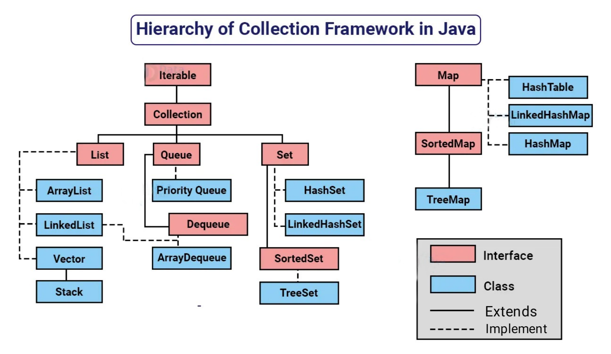

<h1 align = "center">Collection framework</h1>

### Collection framework
- The Java collections framework provides a set of interfaces and classes to implement various data structures and algorithms.
- For example, the LinkedList class of the collections framework provides the implementation of the doubly-linked list data structure.

- digram 

